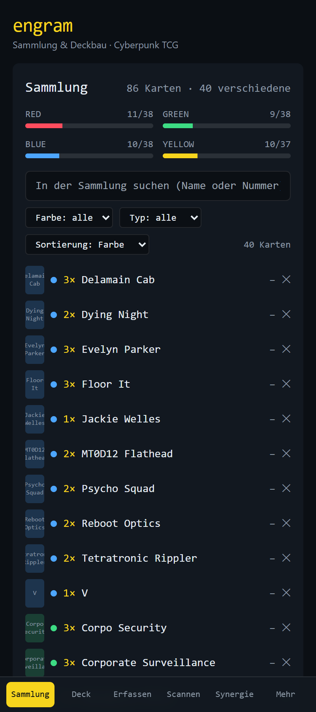
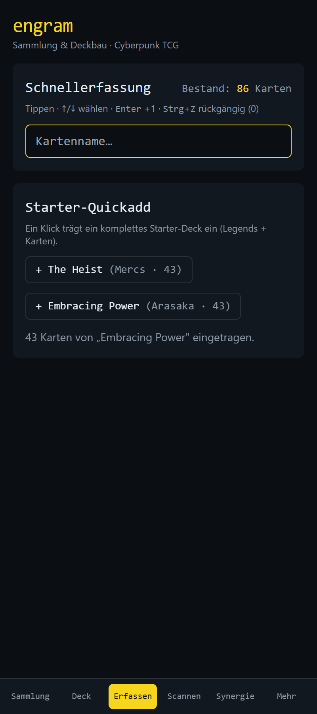
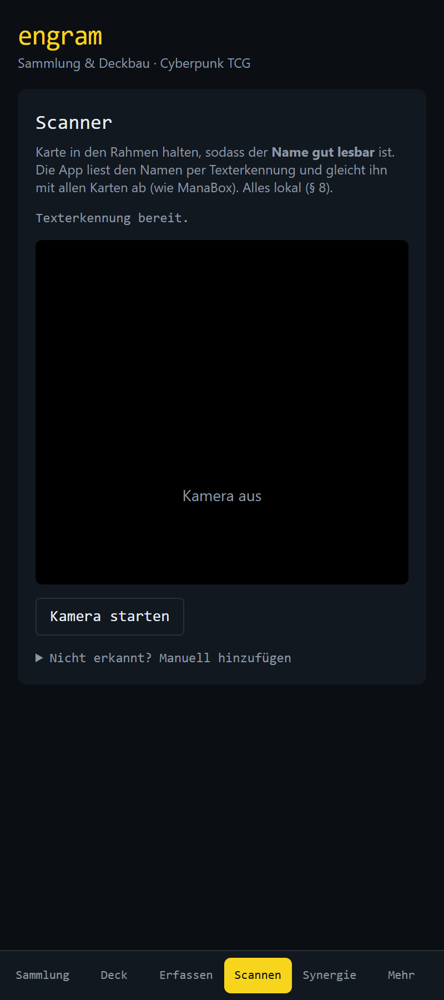
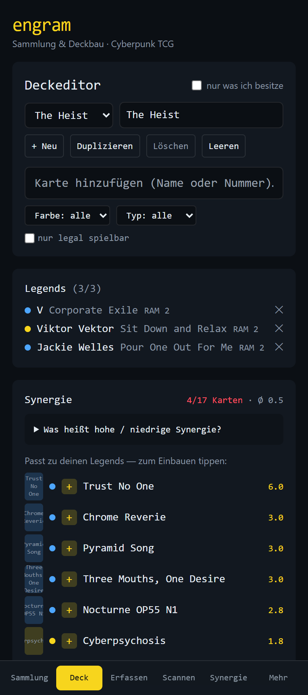
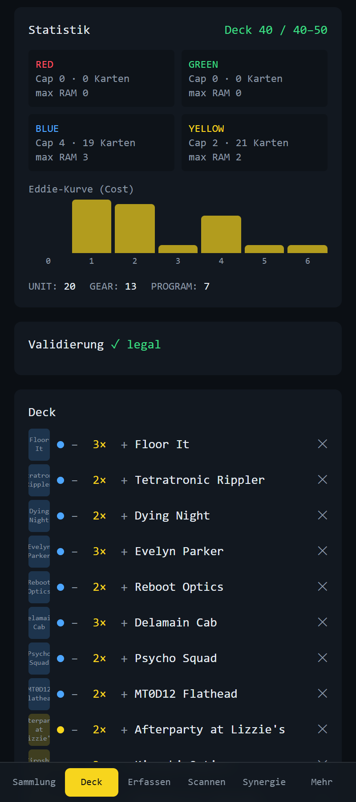
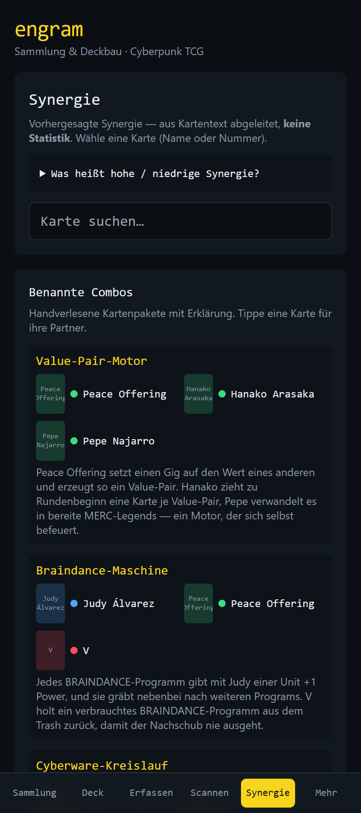

# engram 🖧

[](https://github.com/LordCookie/Engram/actions/workflows/ci.yml)
[](LICENSE)

A **local-first, cloud-free** collection tracker and synergy-aware deckbuilder for the
**Cyberpunk TCG** (WeirdCo / CD PROJEKT RED).

engram is a part-vibe-coded, passion-driven project built to solve a specific problem:
bridging the gap between physical card tracking and intelligent deckbuilding. It combines
the webcam-scanning comfort of apps like **ManaBox** with the data-driven synergy insights
of **EDHREC**, tailored for the Cyberpunk TCG.

Card data is sourced from the **NetDeck API** (`api.netdeck.gg`), the same data that powers
the official card lists. No card images are stored in this repository or the app bundle —
they are linked from the official CDN and cached locally on your device for offline use.

## 📸 Screenshots

> Card artwork appears as engram's **own colored placeholders** in these shots — the app links
> card images from the official CDN at runtime and never bundles or redistributes them (see
> *Disclaimer & Legal*). The mobile-first UI is pictured; it scales up to desktop as well.

<table>
  <tr>
    <td align="center" width="33%"><br><sub><b>Collection</b> — per-color progress, search &amp; filter</sub></td>
    <td align="center" width="33%"><br><sub><b>Quick add</b> — keyboard entry &amp; starter decks</sub></td>
    <td align="center" width="33%"><br><sub><b>Scanner</b> — on-device OCR, ManaBox-style</sub></td>
  </tr>
  <tr>
    <td align="center" width="33%"><br><sub><b>Deck editor</b> — Legends, RAM &amp; live synergy picks</sub></td>
    <td align="center" width="33%"><br><sub><b>Deck stats</b> — cost curve, RAM caps &amp; legality</sub></td>
    <td align="center" width="33%"><br><sub><b>Synergy</b> — text predictions &amp; named combos</sub></td>
  </tr>
</table>

## ✨ Core Philosophy: Why engram?

There are already several deckbuilders out there. engram exists to do the three things the
others don't:

- **Local-first & privacy-focused.** Your collection never leaves your device. No cloud
  storage, no accounts, no logins — everything lives in your browser via **IndexedDB**.
- **Collection-aware deckbuilding.** Instead of just showing you the meta, engram looks at
  *your* card pool and answers: *"Which decks can I actually build with the cards I own, and
  which Legend trio maximizes my collection?"*
- **The full loop (Scan → Track → Build).** Scanning, tracking, and building are no longer
  three separate tools — engram combines them into one workflow.

## 🚀 Key Features

### 📸 Webcam Scanner (OCR)

Batch-add your physical cards. Hold a card in the frame and engram reads the card **name**
with on-device OCR (**Tesseract.js**) and matches it against the full card list, using the
**collector number** to disambiguate same-name cards (e.g. the different "V" Legends).
Recognized cards collect in a **scan basket** and are added to your collection in one tap.
Everything runs locally — no images leave the device.

> Note: an earlier perceptual-hash (pHash) approach was replaced by OCR after testing —
> text recognition proved far more robust for real-world photos across visually similar cards.

### 🧠 Synergy & Legend Solver

Deckbuilding in the Cyberpunk TCG revolves around per-color **RAM** limits and **Legend**
combinations. engram provides:

- A **Legend Solver** that computes valid Legend trios from *only the cards you own* and
  ranks them by how much of your collection they unlock.
- **Swap analysis** — see how changing one Legend unlocks or locks out parts of your pool.
- **EDHREC-style synergy scoring** in three flavors, selectable in the solver and shown while
  building: **predicted** (from structured card-text analysis), **empirical** (co-play from
  your own legal decks), and a **normalized combination** of both.

### ⚡ Fast Tracking & Tools

- Keyboard quick-add and one-click **starter-deck** import for speed.
- **Card detail** view: tap any card for the full image, rules text, stats, your owned count,
  and its best synergy partners.
- Search / filter / sort your collection; **JSON** backup import/export and MTG-style **deck
  text** import/export.
- **Offline-capable PWA:** once loaded, card images are served from a local Service-Worker
  cache, so the app works without a connection.

## 🛠 Tech Stack

- **Frontend:** React 18, TypeScript (`strict`), Vite, Tailwind CSS (Cyberpunk-skinned).
- **State & persistence:** React state + **Dexie.js** (IndexedDB) via `dexie-react-hooks`
  live queries — no external state library, no LocalStorage.
- **PWA / offline:** `vite-plugin-pwa` (Workbox) for the app shell and a runtime image cache.
  Native mobile deployment via **Capacitor** is planned.
- **Data pipeline (offline, Python stdlib):** scripts to fetch card data from the NetDeck API
  and to build the synergy-feature set. A **FastAPI + SQLite** service for community stats is
  planned for Phase 4.
- **Framework-free core:** all rules, validation, the solver, synergy scoring and name/number
  matching live in pure, fully unit-tested TypeScript modules (no UI dependencies).

## 🧑‍💻 Getting Started (developers)

Card data (`cards.json`, `features.json`, …) is **not committed** — it's fetched/generated by
the pipeline (see *Legal* below), so generate it once after cloning:

```bash
git clone https://github.com/LordCookie/Engram.git
cd Engram

# 1) Generate the (gitignored) card data + synergy features
python pipeline/fetch_cards.py         # -> app/src/data/cards.json + printings.json
python pipeline/bootstrap_features.py  # -> app/src/data/features.json (no API key needed)

# 2) Run the app
cd app
npm install
npm run dev        # dev server (http://localhost:5173)
```

Other useful commands (run inside `app/`):

```bash
npm run build      # type-check + production build
npm run test       # unit tests (Vitest)
npm run typecheck  # type-check only
```

Testing the scanner needs a camera and a **secure context** (`localhost` or HTTPS). To try it
from a phone on your LAN: `LAN=1 npm run dev` serves over self-signed HTTPS on port 5174.

### 🧪 Deck simulation (developer tool)

A small console-only test engine lives in `sim/` for **comparing decks and sanity-checking
synergy claims** — it plays decks head-to-head and reports win rates. It is a **rough model,
not a rules-accurate simulator**: single card texts, reactions and dice are abstracted. Two
models are available — a fast aggregate **power proxy** (`--model v1`, default) and a fuller
**combat model** (`--model v2`) with real units, blocking, keywords (Adrenaline / Blocker /
Go Solo) and simple `{Play}` effects (removal, draw). It is a development aid; it is not part
of the app, the bundle, or the CI.

```bash
cd sim && npm install
npm run battle -- --a "The Heist" --b "Embracing Power" --games 300 --model v2
npm run game   -- --a "The Heist" --b "Embracing Power" --seed 7 --model v2   # one game, verbose log
npm run build-decks -- --model v2    # assemble strong decks from legal Legend trios
npm test                             # engine tests (determinism, mirror ≈ 50%, dominance …)
```

## 🗺 Roadmap & Current Status

- **Phase 1 — Tracker:** ✅ Done. Fast manual entry, Dexie persistence, collection views with
  search/filter/sort, JSON backups.
- **Phase 2 — Deckbuilder:** ✅ Done. Rule validation, collection-aware Legend Solver, live deck
  stats, swap analysis, and synergy suggestions while building.
- **Synergy engine:** ✅ Done. Predicted (card-text) + empirical (your own legal decks) +
  normalized combination.
- **Phase 3 — Scanner:** 🔄 In progress. On-device OCR name + collector-number matching; running
  on mobile over LAN HTTPS.
- **Phase 4 — Stats service:** 🔄 In progress. The **local ingest pipeline** is already in place
  (`pipeline/ingest_decks.py` aggregates legal decklists into a co-play corpus that the app
  merges with your own decks); a FastAPI/SQLite service to broaden the signal from community
  decklist data is the next step.
- **Phase 5 — Native mobile app:** ⏳ Upcoming. Wrapping the PWA into a **native Android app**
  (and iOS) via **Capacitor**, for a real installable app with camera access.
- **Playtest / simulation mode:** 🔄 First version live (under **More**). A **manual
  practice-turn sandbox** (ManaBox-style — real zones, you move the cards, no forced rule
  engine): pick a legal own deck or a starter, draw your opening hand, mulligan, and walk
  through turns (ready → draw → gig) to sanity-check your curve and combos before the table.

## 📄 License

The engram **source code** is released under the **MIT License** — see [LICENSE](LICENSE).
This does **not** cover the Cyberpunk TCG intellectual property (see the Disclaimer below).

## ⚖️ Disclaimer & Legal

engram is an **unofficial fan project** and is **not** affiliated with, endorsed, sponsored, or
approved by WeirdCo, CD PROJEKT RED, or NetDeck.

Card names, rules text, and the Cyberpunk IP are the property of CD PROJEKT RED and WeirdCo.
This app **does not host or redistribute card images or card data** — card data is fetched from
the NetDeck API into your local database, and images are linked from the official CDN and cached
only on your own device. Generated card data is kept out of this repository by design.

engram is built for personal, local use to enhance the physical tabletop experience.
